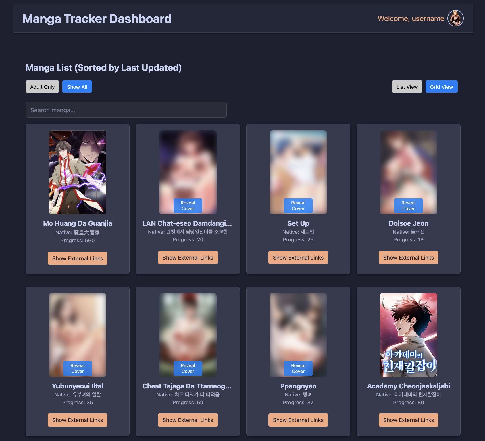

# Manga Tracker Dashboard

A modern, dark‑themed dashboard to track your manga collection from AniList. This tool integrates your AniList manga list, provides fuzzy search through your titles and synonyms, and automatically finds external reading links from multiple websites (with separate strategies for adult and non‑adult content).



## Table of Contents

- [Overview](#overview)
- [Features](#features)
- [Installation](#installation)
- [Usage](#usage)
- [Development & Running Both Frontend and Backend](#development--running-both-frontend-and-backend)
- [Configuration](#configuration)
- [Future Plans](#future-plans)
- [License](#license)

## Overview

The Manga Tracker Dashboard connects to the AniList GraphQL API to retrieve your personal manga list. It then allows you to:
- **Filter** your list by adult content or view all manga.
- **Search** titles (display name, native, synonyms) using fuzzy‑search (powered by Fuse.js) so that minor spelling differences won’t cause mismatches.
- **Toggle** between a traditional list view and a modern grid view.
- **Display external reading links** by searching dedicated websites:
  - For **adult manga**, it uses Omegascans and Toongod.
  - For **non‑adult manga**, it uses Comick (which uses a standard URL pattern).
- Enjoy a sleek dark theme inspired by popular modern designs (with fonts similar to Segoe UI, Tahoma, or even Helvetica).

## Features

- **AniList Integration:**  
  Fetches your manga list (with titles, synonyms, and cover images) using AniList’s GraphQL API.
  
- **Adult Content Filter:**  
  Toggle between "Adult Only" and "Show All" views. (The adult filter uses AniList’s `media.isAdult` and tag information.)
  
- **Fuzzy Search:**  
  Quickly search your manga by display title, English title, native title, or synonyms (powered by [Fuse.js](https://fusejs.io/)).

- **View Modes:**  
  Switch between a list view and a grid view (with nicely rounded cover images, etc.) to suit your preference.

- **External Links Search:**  
  For adult manga, external search is performed on Omegascans and Toongod. For non‑adult manga, only Comick is used. (The tool automatically verifies candidate links using custom logic to work around anti‑bot responses.)

- **Modern, Dark Theme:**  
  Enjoy a dark dashboard with modern fonts and a clean, elegant UI.

- **User Integration:**  
  (In future versions) Display your AniList username and avatar in the header.

## Installation

### Prerequisites

- [Node.js](https://nodejs.org/) (v14+ is recommended)
- npm

### Project Structure

/manga-tracker /backend package.json src/ controllers/ services/ app.js /frontend package.json src/ components/ services/ App.js

### Setup

1. **Clone the Repository:**
   ```bash
   git clone https://github.com/yourusername/manga-tracker.git
   cd manga-tracker
2. **Install Backend Dependencies:**
   ```bash
    cd backend
    npm install
3. **Install Frontend Dependencies:**
   ```bash
    cd ../frontend
    npm install
4. **Configure Environment Variables:**
   ```bash
    ANILIST_API_URL=https://graphql.anilist.co
    ANILIST_USER=yourAniListUsername
    PORT=5001
   
### Usage

**Method 1: Seperate Terminals**
  1. **Backend**
     Open a terminal, navigate to the backend, and run:
     ```bash
      npm run dev
  2. **Frontend**
     Open another terminal, navigate to the frontend folder, and run:
     ```bash
      npm start
